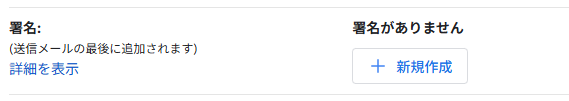
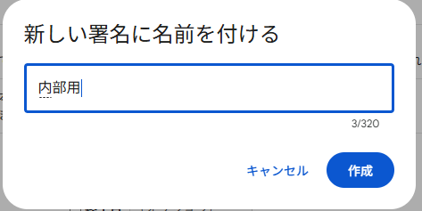
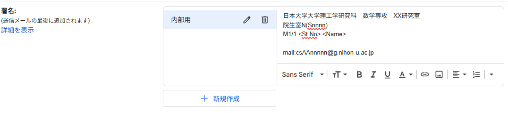

# 署名を入れよう！
メールの末尾にいちいち「日本大学大学院理工学研究科 数学専攻M○ △△△△…」と直打ちしていませんか？

…それGmailの「署名機能」で解決できますよ

## 署名に書いておくとよい(と思われる)情報
- 学校名(日本大学大学委理工学研究科 数学専攻M1/2)
- 指導教員名(またはXX研究室)
- 院生室番号(S14nn)
- 学年(M1/2)/学籍番号(St.No)/名前(Name)
- メールアドレス

~~~
(例)
日本大学大学理工学研究科　数学専攻　XX研究室
院生室N(Snnnn)
M1/1 <St.No> <Name>

mail:csAAnnnnn@g.nihon-u.ac.jp
~~~

## 署名に書かないほうがよい(と思われる)情報
- 自宅or 下宿の住所
- 電話番号

# 設定の手順
1. Gmail右上の歯車マークをクリック
1. 「すべての設定を表示」をクリック
1. 下から4番目の「署名」の「+新規作成」をクリック
 

1. 署名に名前を付ける(なんでもOK　内部用/大学院/就活用など)
 

1. 右のフィールドに署名内容を書き込む

1. 下の「新規メール用」「返信/転送用」のプルダウンで設定した署名の名前を選択(今回なら内部用)
1. 設定一番下の「変更を保存」をクリック
