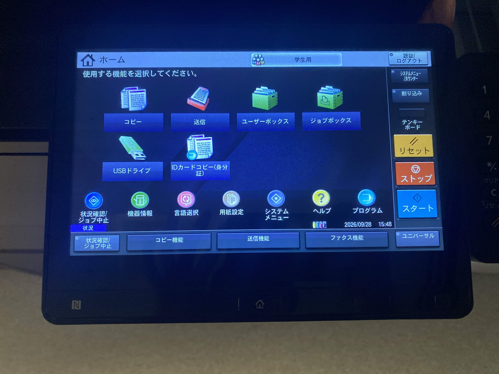
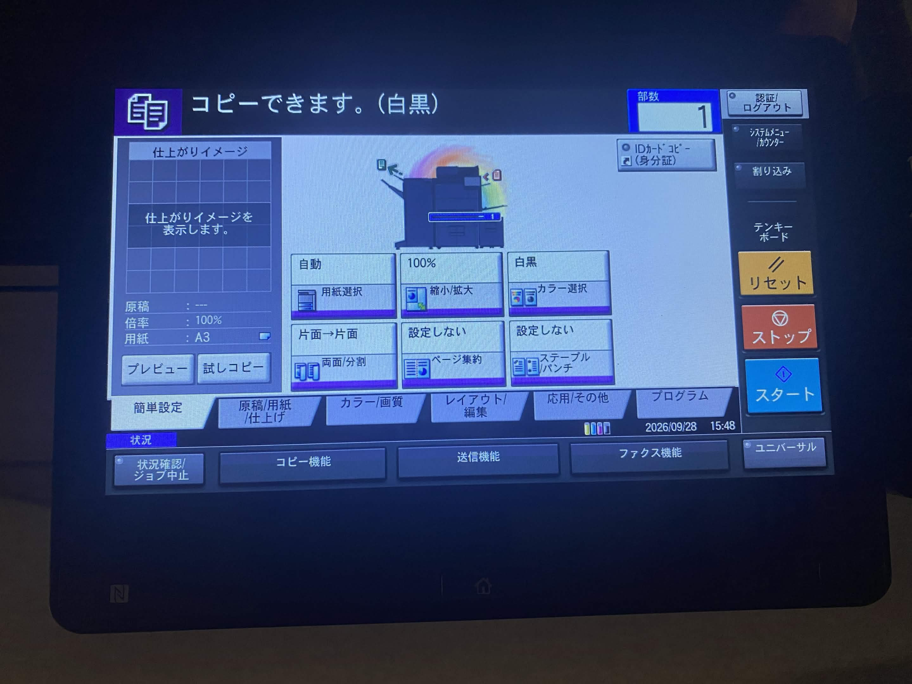
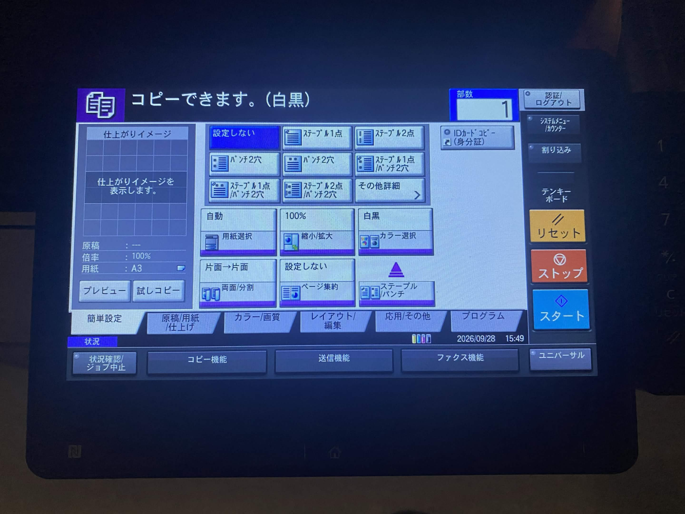
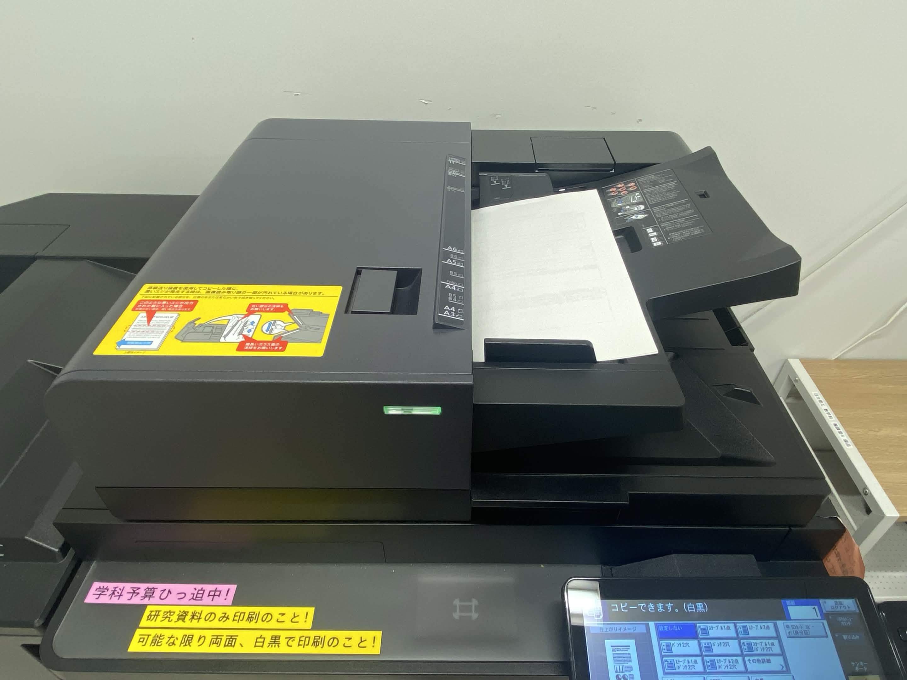

# プリンタ系
### プリンタで印刷する
1. 右上の「このファイルを印刷」をクリック(or `Ctrl P`)
1. 右上のプロパティ->カラーの項目を「白黒」に変更(院生権限ではカラーはできない)
1. 印刷を押すと部門コードを聞かれるので555と入力    

### スキャナとしてプリンタを使う
輪講室4(平田先生・古津先生部屋)・図書館2のプリンタはスキャナとして使うこともできます．
1. プリンタに直接USBを差し込む．
1. 「USBを認識しました．ファイルを表示します．よろしいですか？」と表示されるので「はい」を選択．
1. 右下の「文書保存」を選択．
1. 設定2/3の連続読み込みを設定するに変更(USBを取り外すまでスキャンしたものが1つのファイルにまとまる)
1. 読み込み面にスキャンする原稿を置き，スタートを押してスキャン開始．
1. すべてのスキャンが終了したら「USB取り外し」を押してUSBを取り外す(適当な名前で保存されているはずなのでPCでリネーム)

※輪講室のプリンタより数学科図書館1(S1421)のプリンタの方がやりやすいです．
~図書委員のmznは非推奨~

# プリンタでホチキス止めをする
## 前準備
1. ホチキス止めする資料を1部マスターとして用意する(前の`プリンタで印刷する`を参照)

1. 部門コード(555)を入力してログイン
1. 左上コピー機を押す
   
1. 右下「ステープル/パンチ」を押し，任意の設定にする(中央上の「ステープル1点」が最適)
    
1. 資料を上の読み取り部分に順番通り乗せスタートさせる
   
